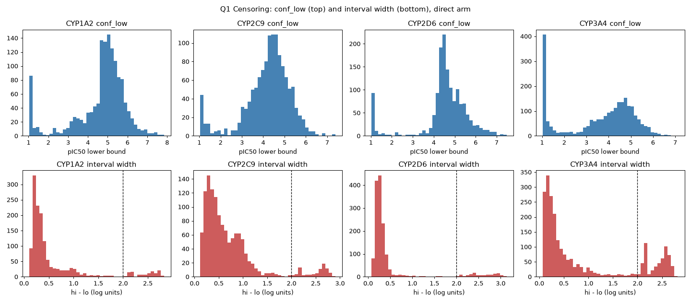
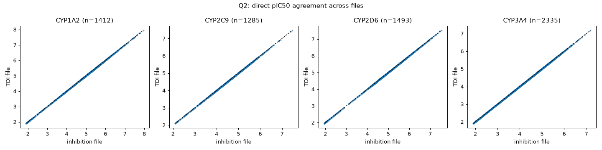
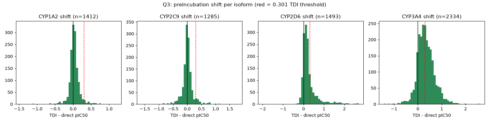
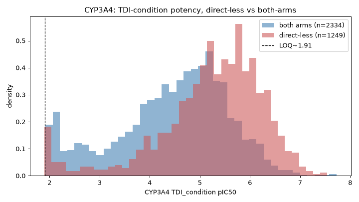
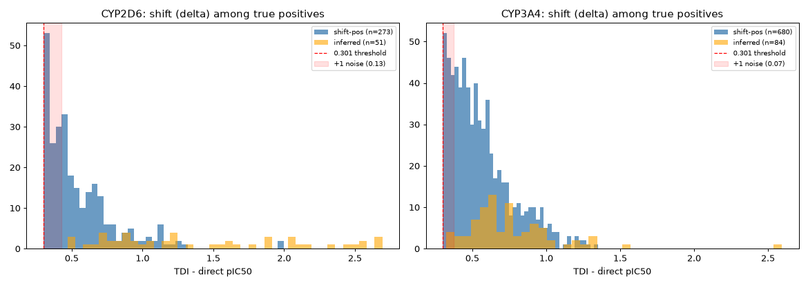
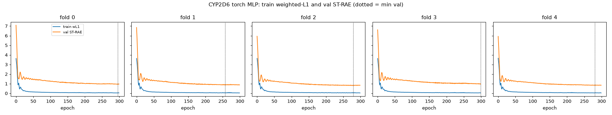

# Data findings

Exploratory analysis of the pinned dataset
(`openadmet/cyp-challenge-train-test` @ `3ac9c5db`). The confirmed conventions
that modelling code must follow live in `CLAUDE.md` ("Confirmed data
conventions"); this file is the evidence behind them — tables, plots, and noise
estimates.

Isoforms: CYP1A2, CYP2C9, CYP2D6, CYP3A4. "Arm" = `direct_inhibition` (no
preincubation) vs `TDI_condition` (+NADPH preincubation). Analysis source is
`cyp-challenge-TRAIN_TDI.csv` unless noted; `cyp-challenge-TRAIN_inhibition.csv`
is a redundant subset (see below).

## 1. Censoring is already encoded in the credible intervals

The reported `_conf_low` / `_conf_high` bounds carry the left-censoring signal,
so the `(-inf, 4.0]` special case is unnecessary — consume the bounds verbatim.

| isoform | n | conf_low floor | % at floor (~1.03) | median width | **% width > 2** |
|---|---|---|---|---|---|
| CYP1A2 | 1412 | 1.030 | 4.0% | 0.33 | 8.4% |
| CYP2C9 | 1285 | 1.049 | 1.9% | 0.53 | 6.6% |
| CYP2D6 | 1493 | 1.030 | 4.8% | 0.27 | 8.6% |
| CYP3A4 | 2335 | 1.029 | 10.9% | 0.38 | **23.6%** |

- **Interval width is bimodal**: a dominant narrow mode at ~0.2–0.5 plus a
  distinct second cluster at ~2.0–2.8. The second cluster is the censored
  population. CYP3A4 has by far the most censoring (23.6% of rows wider than 2
  log units), consistent with it having the most weak/inactive compounds.
- **`conf_low` piles up at a finite floor ~1.03** (not −inf, not 4.0). A
  censored compound is `[~1.03, conf_high]` with a wide interval.

## 2. `TRAIN_inhibition` is a redundant strict subset of `TRAIN_TDI`

Use `TRAIN_TDI` as the single training source and ignore `TRAIN_inhibition`.

- Name sets: `in TDI not in inhibition = 1240`; `in inhibition not in TDI = 0`.
  TRAIN_inhibition ⊂ TRAIN_TDI.
- For every shared compound and every isoform the direct pIC50 is
  **byte-identical**: Pearson = 1.0000, MAE = 0.0000, max abs diff = 0.0000.
  Same assay campaign, not a re-run.
- The 1,240 TDI-only compounds add **0** direct-arm labels — 1,238 are CYP3A4
  `TDI_condition`-only measurements. Pooling does not buy direct-arm compounds.

## 3. Preincubation shift supports `delta >= 0` for the scored isoforms

Shift = `TDI_condition - direct`, over rows with both arms measured.

| isoform | n | median shift | % negative | % < −0.1 | **% < −0.301** | ~noise on diff |
|---|---|---|---|---|---|---|
| CYP1A2 | 1412 | +0.024 | 38.5% | 9.5% | 2.5% | 0.12 |
| CYP2C9 | 1285 | +0.007 | 46.8% | 17.7% | 4.6% | 0.19 |
| **CYP2D6** | 1493 | +0.154 | 13.5% | 3.2% | **0.3%** | 0.10 |
| **CYP3A4** | 2334 | +0.307 | 13.3% | 7.0% | **2.6%** | 0.11 |

- The two **scored** TDI isoforms (CYP2D6, CYP3A4) are predominantly positive;
  the `delta >= 0` softplus is a good fit.
- CYP1A2/CYP2C9 (not scored for TDI) center on ≈0. Their negatives are frequent
  but small — comparable to the propagated measurement noise (~0.12 / ~0.19,
  from the reported `_std` columns via √(σ_direct² + σ_tdi²)) — and only 2.5% /
  4.6% exceed −0.301. The constraint is harmless there.

## Noise estimates

**Shift-noise estimator (used throughout this document).** For each row,
propagate the two reported per-measurement stds into the noise on the shift,
`σ_shift = √(σ_direct² + σ_TDI²)`, then take the **median over the specified
row set**. The "shift noise" column below is that median over all both-arms
rows. (An earlier note quoted ~0.10 / ~0.11 for CYP2D6/CYP3A4 from
`hypot(median σ_direct, median σ_TDI)`; that hypot-of-medians shortcut is
dropped in favour of this per-row-then-median derivation, which is what §5 also
uses.)

| isoform | median direct `_std` | median TDI `_std` | shift noise (all both-arms rows) |
|---|---|---|---|
| CYP1A2 | 0.084 | 0.088 | 0.121 |
| CYP2C9 | 0.137 | 0.133 | 0.194 |
| CYP2D6 | 0.069 | 0.065 | 0.098 |
| CYP3A4 | 0.095 | 0.061 | 0.123 |

## 4. Empirical LOQ, and why the CYP3A4 "direct-less" rows are not censored

### Empirical LOQ ≈ 2.0, with no hard edge

Lower tail of the observed direct pIC50 point estimates (rows that have one):

| isoform | n | min | p1 | p5 | % within 0.5 of min |
|---|---|---|---|---|---|
| CYP1A2 | 1412 | 1.906 | 2.000 | 2.679 | 4.0% |
| CYP2C9 | 1285 | 2.098 | 2.249 | 3.248 | 2.2% |
| CYP2D6 | 1493 | 1.947 | 2.024 | 2.617 | 4.4% |
| CYP3A4 | 2335 | 1.909 | 1.964 | 2.094 | 12.1% |

There is **no hard left edge at 4.0** — nor a spike piling on any single floor
value. The point estimates simply thin out around pIC50 ≈ 1.9–2.1 (pooled
p1 ≈ 2.0). The censoring signal lives in `conf_low` (which floors near 1.03,
see §1), not in the point estimate. So the assumed `4.0` limit of quantitation
is wrong; the empirical LOQ of the fitted point is ~2.0.

### The direct arm was never assayed for 1,249 CYP3A4 rows

CYP3A4 has 1,249 rows with a measured `TDI_condition` pIC50 but no direct pIC50
(≈35% of its 3,584 TDI labels). These are **not left-censored weak compounds**:

- **Every direct-side column is 100% NaN** for these rows — `pIC50`,
  `conf_low`, `conf_high`, `std`. Not a low fit or a wide fit: no fit at all.
- **Emax-file evidence:** all 1,249 appear in `TRAIN_Emax.csv` with a
  TDI-condition Emax measured and **zero** direct-inhibition Emax. The direct
  arm was never run.
- Their TDI-condition potency **skews higher** than both-arms rows (median
  **5.40 vs 4.63**): 88.5% exceed pIC50 4.0, 66.8% exceed 5.0, and 283 rows
  (22.7%) exceed 6.0 (1 µM — genuinely potent). Examples, all `is_TDI=False`:
  `OCNT-0454261` (7.27), `OCNT-0454289` (6.89), `OCNT-0454217` (6.78).
- **All 1,249 are `is_TDI = False`** — an assigned default, since no direct arm
  means no measurable shift. It carries no experimental information about `mu`.

Consequence: never supervise `mu` on these rows (a `(-inf, LOQ]` target would
fabricate a large shift on potent compounds), and never let them into TDI
classification training or internal evaluation.

### Organizer labeling taxonomy (challenge Space FAQ)

The Space FAQ (`config.py`) confirms `is_TDI` is a deterministic function of the
two arms relative to the pIC50 = 4 reliable lower limit:

- **Positive** — direct pIC50 > 4 and shift > 0.301 (2-fold).
- **Negative** — direct pIC50 > 4 and shift ≤ 0.301.
- **Inferred positive** — direct pIC50 < 4 but TDI-arm pIC50 > 4.301.
- **Assigned negative** — direct pIC50 < 4 *and* TDI-arm pIC50 < 4 ("labeled
  negative by convention").

Scored positive = positives + inferred positives; scored negative = negatives +
assigned negatives. The FAQ adds that on the blinded test, predictions are
requested for every compound, but "only compounds whose label can be assigned
with confidence contribute to the score." Note the organizers' formal *assigned
negative* (both arms measured and < 4) is a **different** population from the
training-only *direct-arm-never-assayed* rows above.

## 5. CYP2D6 TDI: a partial label-noise / boundary ceiling

Recorded **before** attempting to beat it, so any later gain has an honest
baseline. The LightGBM baseline reaches OOF MCC ≈ 0.35 on CYP3A4 but only ≈ 0.10
on CYP2D6. This section asks whether that gap is intrinsic (label noise near the
2-fold boundary) rather than purely a featurization problem.

**Folds are not the cause.** Positives are well spread across the baseline
scaffold folds for both isoforms:

| fold | CYP2D6 n / pos / rate | CYP3A4 n / pos / rate |
|---|---|---|
| 0 | 299 / 72 / 24.1% | 467 / 147 / 31.5% |
| 1 | 299 / 62 / 20.7% | 467 / 161 / 34.5% |
| 2 | 299 / 68 / 22.7% | 467 / 157 / 33.6% |
| 3 | 298 / 65 / 21.8% | 467 / 159 / 34.0% |
| 4 | 298 / 57 / 19.1% | 466 / 140 / 30.0% |

**2D6 positives sit closer to the 2-fold boundary and are measured more
noisily.** The distance-to-flip is `δ − 0.301` for shift-positives (direct ≥ 4)
and `TDI_arm − 4.301` for inferred positives (direct < 4). The shift-noise here
is the same `√(σ_direct²+σ_TDI²)` estimator as §Noise estimates, restricted to
each isoform's **true positives** (the population this question is about); the
all-rows values in §Noise estimates differ because CYP3A4's negatives are
noisier than its positives.

| metric | CYP2D6 | CYP3A4 |
|---|---|---|
| true positives (shift / inferred) | 324 (273 / 51) | 764 (680 / 84) |
| base rate | 21.7% | 32.7% |
| shift-positives with δ in (0.301, 0.401] | 32.2% | 26.2% |
| median margin-to-flip | 0.169 | 0.210 |
| p25 margin-to-flip | 0.069 | 0.095 |
| shift noise among positives | 0.126 | 0.075 |
| positives within 1× noise of flipping | 38.6% | 19.2% |
| positives within 2× noise of flipping | 61.4% | 38.0% |

**Honest framing.** CYP2D6 faces a label-noise / boundary ceiling that CYP3A4
largely does not: its positives are both nearer the 2-fold cutoff and measured
with roughly 1.7× the noise, so ~60% of them sit within 2σ of flipping to
negative versus ~38% for CYP3A4 — a large share are effectively coin-flips at
the label boundary even with perfect features. This is compounded by CYP2D6
having less than half as many positives (324 vs 764) at a lower base rate. It is
**not an absolute ceiling**: CYP3A4 reaches MCC 0.35 with its own boundary
cases, and CYP2D6's small positive set leaves room for better features or more
data to help. (Caveat on the estimator: measured over *all* both-arms rows
instead of positives, the two isoforms' within-2σ fractions are comparable
(~54% vs ~57%); the contrast above is specifically a property of the positive
sets, which is the relevant population for a label-noise argument.)

## 6. Baseline submission — OOF vs blind leaderboard

To test whether scaffold-split OOF tracks the blind leaderboard while there is
still time to correct course, the reference baseline is **submitted to the
interim leaderboard**, so the OOF-vs-blind comparison is anchored to known
models. The two tracks are separate files and have diverged, so each carries its
**own commit anchor** — they cannot share one. The upload itself is an
interactive Space form tied to a HuggingFace account and public disclosure
checkboxes (open-source code + report link, proprietary-data flag), so it is
performed by a maintainer, not automated; the validated files and the numbers to
compare are recorded here.

- **Submission portal:** open. The challenge is a single continuous stage;
  submissions run **2026-08-17 → 2026-11-03 (23:59 UTC)**. The **intermediate
  leaderboard deadline is 2026-09-24 (23:59 UTC)** and the interim leaderboard
  (a one-time full-test-set performance reveal) is released **2026-09-25**.
- **Submission code anchors (per track):**
  - **Regression** — commit **`5d5dbdd`** (`submissions/regression.parquet`),
    unchanged since the baseline.
  - **Classification** — commit **`75fe72e`** (`submissions/classification.parquet`),
    which applies the CYP2D6 decision-threshold override 0.10 → 0.30 (§10). The
    regression file is byte-identical to the `5d5dbdd` version; only the
    classification file changed.
- **Local scaffold-split OOF (the numbers being compared):**

| isoform | OOF ST-RAE | OOF MAE | OOF MCC (TDI) |
|---|---|---|---|
| CYP1A2 | 0.526 ± 0.017 | 0.652 ± 0.013 | — |
| CYP2C9 | 0.364 ± 0.019 | 0.489 ± 0.017 | — |
| CYP2D6 | 0.617 ± 0.012 | 0.600 ± 0.044 | 0.097 ± 0.045 |
| CYP3A4 | 0.298 ± 0.019 | 0.570 ± 0.023 | 0.347 ± 0.059 |

- **Interim blind leaderboard result:** _to be filled from the 2026-09-25
  reveal._ If the blind ST-RAE is materially worse than OOF — especially on the
  isoforms where the baseline predictions are narrowest (see the mean-regression
  check) — scaffold OOF is optimistic on this hit-expansion test set and the
  training/eval protocol needs revisiting before 2026-11-03.

## 7. Narrow baseline predictions are shrinkage, not domain shift

The baseline's predicted pIC50 spans are much narrower than the training
targets. Comparing training targets to *blinded* predictions confounds two
causes (shrinkage vs the test set being far from training); comparing **OOF
predictions to blinded predictions from the same fitted models** separates them.

| isoform | train target (std / IQR) | OOF pred (std / IQR) | blinded pred (std / IQR) |
|---|---|---|---|
| CYP1A2 | 1.03 / 1.00 | 0.36 / 0.45 | 0.40 / 0.58 |
| CYP2C9 | 0.78 / 0.92 | 0.36 / 0.47 | 0.45 / 0.70 |
| CYP2D6 | 0.92 / 0.83 | 0.23 / 0.30 | 0.22 / 0.25 |
| CYP3A4 | 1.09 / 1.50 | 0.71 / 0.88 | 0.72 / 0.88 |

OOF and blinded predictions are equally narrow on every isoform (within ~0.05
std), and both are far narrower than the targets. The model reverts toward the
mean **in-domain**, on held-out training compounds — the blinded set adds
nothing to the narrowness. So this is **shrinkage, not domain shift**; the lever
is regularization / the objective, not domain adaptation.

**Similarity of the blinded set to training (ECFP4 Tanimoto, nearest neighbour).**
Median NN similarity to the full training set is **0.587** (p25 0.543, p75
0.639); every blinded compound has a neighbour above 0.4, but only **10%
(76/750) clear 0.7**. Per-isoform (to each direct-present training subset)
medians are 0.47–0.54 with 3–6% above 0.7.

| target set | median NN Tanimoto | % > 0.7 |
|---|---|---|
| full training (6,145) | 0.587 | 10% |
| CYP1A2 subset | 0.517 | 4% |
| CYP2C9 subset | 0.518 | 3% |
| CYP2D6 subset | 0.471 | 3% |
| CYP3A4 subset | 0.538 | 6% |

So the blinded set is **not** near-duplicate hit expansion off the training
rows — the analogs are genuinely new, sitting in a neighbourhood the model has
seen but not on top of it. This makes scaffold-split OOF a **more credible proxy
for blind performance than originally assumed** (the announcement's "75 potent
parents + nearest chemisimilars" framing implied much tighter overlap). The
report's framing should follow this measurement rather than the announcement's
description.

**Leakage check.** 0 of 750 blinded `Molecule_Name`s appear in training.

**Interpretive note (recorded, to be tested — not assumed).** Prediction width
tracks predictive accuracy across isoforms: CYP3A4 is widest (blinded pred std
0.72) and has the best OOF ST-RAE (0.298); CYP2D6 is narrowest (0.22) and has
the worst (0.617), with CYP2C9 and CYP1A2 ordered in between on both axes
simultaneously. That is exactly how an L1-fitted conditional median behaves when
the features explain limited variance — it shrinks toward the median where it is
uncertain. So shrinkage is **not assumed to be a defect**; it is a hypothesis to
test against the metric (does widening the predictions improve ST-RAE?), not a
bug to fix on sight. See §8.

## 8. Regularization grid: widening predictions does not help the metric

Testing the §7 hypothesis directly — refit the baseline regression with weaker
regularization (`colsample_bytree` 0.5→0.8, trees 500→1500) and read off, per
isoform, the OOF prediction std and OOF ST-RAE (mean ± fold std). Baseline is
`(0.5, 500)`.

| isoform | (colsample, trees) | OOF pred std | OOF ST-RAE (mean ± fold sd) |
|---|---|---|---|
| CYP1A2 | (0.5, 500) *baseline* | 0.359 | 0.526 ± 0.017 |
| CYP1A2 | (0.5, 1500) | 0.393 | 0.524 ± 0.021 |
| CYP1A2 | (0.8, 1500) | 0.398 | 0.529 ± 0.022 |
| CYP2C9 | (0.5, 500) *baseline* | 0.361 | 0.364 ± 0.019 |
| CYP2C9 | (0.5, 1500) | 0.385 | 0.361 ± 0.020 |
| CYP2C9 | (0.8, 1500) | 0.395 | 0.362 ± 0.020 |
| CYP2D6 | (0.5, 500) *baseline* | 0.228 | 0.617 ± 0.012 |
| CYP2D6 | (0.5, 1500) | 0.241 | 0.618 ± 0.014 |
| CYP2D6 | (0.8, 1500) | 0.248 | 0.618 ± 0.010 |
| CYP3A4 | (0.5, 500) *baseline* | 0.712 | 0.298 ± 0.019 |
| CYP3A4 | (0.5, 1500) | 0.743 | 0.295 ± 0.018 |
| CYP3A4 | (0.8, 1500) | 0.752 | 0.296 ± 0.017 |

(The `(0.8, 500)` cell is omitted for brevity; it sits between the rows shown and
changes nothing.)

Weaker regularization does widen the predictions — OOF pred std rises ~0.02–0.04
per isoform — but **ST-RAE is flat**: every setting is within fold-to-fold
variance of the baseline on every isoform. The largest nominal move is CYP3A4
(0.298 → 0.295 at 1500 trees), 0.003 against a ±0.018 fold std, i.e. noise.

**Conclusion.** The shrinkage is not a regularization defect. Consistent with §7,
these are L1 conditional-median predictions shrinking where the features explain
limited variance; forcing them wider neither helps nor hurts the metric. So the
regularization lever is exhausted — the submission is **unchanged** (no ST-RAE
improvement beyond fold variance, per the decision rule). Gains will have to come
from better signal (features/representation) or the interval-hinge two-head
objective, not from de-shrinking a median regressor.

## 9. Interim leaderboard state

Recorded 2026-09-22 from the challenge leaderboard. Metrics are macro-averaged
across the scored isoforms: **MA-ST-RAE** (regression, lower is better) and
**MA-MCC** (classification, higher is better).

| track | leaderboard top | rank 11 | ours |
|---|---|---|---|
| Regression (MA-ST-RAE) | 0.3814 | 0.4404 | 0.451 (local macro OOF) |
| Classification (MA-MCC) | 0.4647 | 0.4091 | 0.222 (baseline macro; CYP3A4 0.347, CYP2D6 0.097) |

Reading: on regression our local macro OOF (0.451) would sit just off the rank-11
cut (0.4404), and the field is tight (top 0.3814). On classification we are far
back — macro 0.222 vs a 0.4091 rank-11 cut — dragged down by CYP2D6 (0.097). Most
leaderboard entries carry **no model-report link**, so the field's methods are
largely undisclosed.

## 10. TDI threshold calibration: a discrimination gap, not a calibration one

The baseline's TDI thresholds are tuned to the OOF-argmax MCC (CYP3A4 0.35,
CYP2D6 0.10). Two facts about that:

**MCC's optimal threshold is prevalence-invariant here.** Reweighting the OOF to
simulate blind positive rates of 15/20/25% barely moves the argmax — CYP3A4 stays
at 0.35 under every balance, CYP2D6 stays at 0.10 (nudging to 0.30 only at 15%,
with identical MCC). MCC already accounts for class balance, so re-tuning the cut
to the blind prevalence recovers no MCC.

**Our submitted positive rates were far above prevalence.** At the tuned cuts the
submission called **46.9%** (CYP2D6) and **40.1%** (CYP3A4) of the 750 blinded
compounds positive, against an estimated blind scored prevalence near **17%**.
That is not a fixable miscalibration: it is what the MCC-optimal thresholds
produce given weak classifiers (the low CYP2D6 cut is "best of a bad lot").

**So the classification gap is a discrimination problem, not a calibration one.**
The lever is model quality — better features / the two-head model — not the
threshold, especially for CYP2D6, which also carries the §5 label-noise ceiling.

*Caveat:* this all assumes the blind set's per-class score distributions resemble
OOF. With no blind labels we cannot check it; §7 argues OOF is a credible proxy.

**Applied change — CYP2D6 threshold 0.10 → 0.30 (variance reduction, not a score
grab).** Simulated MCC is unchanged (0.097 at both cuts), but 0.10 sits at an
extreme of the decision function where the predicted positive count is highly
sensitive to any shift in the blind score distribution; 0.30 gives the same
expected MCC with less variance, and at the ~17% estimated prevalence the sweep
actually favours it. The change drops the CYP2D6 submitted positive rate from
46.9% to **13.2%** (99/750) — in line with prevalence — with no expected MCC cost.
Encoded as `baseline.TDI_THRESHOLD_OVERRIDE`; the classification submission was
regenerated (CYP3A4 unchanged at 0.35 / 40.1%).

## 11. Two-head encoder diagnostic: the fold-variance blow-up was optimization

Before running ablations, the neural two-head model's baseline-closest config
(ecfp + per-isoform + point) was far worse than LightGBM with fold std 3–4× the
baseline's. This section isolates why.

**Feature cleaning.** Dropping degenerate columns before standardizing (rather
than clipping after): `Ipc` (1), near-zero-variance (14), non-finite (0) → 2,250
of 2,265 features kept.

**Four learners, identical cleaned features and folds** (OOF ST-RAE, mean ± fold sd):

| isoform | LightGBM | Ridge | sklearn-MLP | torch-MLP (pre-fix) |
|---|---|---|---|---|
| CYP1A2 | 0.525 ± 0.013 | 0.593 ± 0.025 | 2.038 ± 0.296 | 0.844 ± 0.057 |
| CYP2C9 | 0.367 ± 0.021 | 0.384 ± 0.027 | 2.111 ± 0.146 | 0.660 ± 0.063 |
| CYP2D6 | 0.612 ± 0.009 | 0.690 ± 0.025 | 2.101 ± 0.153 | 0.896 ± 0.073 |
| CYP3A4 | 0.297 ± 0.020 | 0.309 ± 0.020 | 0.945 ± 0.099 | 0.460 ± 0.035 |

**Ridge nearly matches LightGBM** — the direct-pIC50 signal in these features is
largely linear, and a regularized linear model is near-optimal. Both neural nets
underperformed: `sklearn-MLP` catastrophically (worse than predict-a-constant),
the torch MLP by ~0.15–0.35 with inflated fold variance.

**Root causes (all fixed).** The CYP2D6 loss curves showed train weighted-L1
collapsing to ~0 by epoch 50 while validation ST-RAE plateaued high — classic
overfitting, plus two setup bugs:

1. **Unbounded features** (`Ipc` ~1e14, rare bits >70σ) destabilized the MLP →
   *drop* them before standardizing.
2. **Output-bias decay:** strong `weight_decay` under Adam shrank the output
   bias toward 0, pulling predictions toward 0 instead of the mean pIC50 (ST-RAE
   >1) → *standardize the target* so 0 is the mean.
3. **Too few optimizer steps / overfitting** from full-batch training and a wide,
   weakly-regularized net → *minibatch Adam* with stronger regularization.

**After the fixes**, the two-head control (ecfp + per-iso + point) lands at
0.634 / 0.454 / 0.708 / 0.338 with fold std **0.012–0.037** (was 0.06–0.54) —
the fold-variance blow-up was optimization, now resolved. Seed-ensembling and
further regularization did not close the residual ~0.02–0.07 gap to ridge: on a
near-linear signal an MLP can match but not beat a regularized linear model, so
that remainder is model-class, not a bug.

**Useful negative result.** That ridge ≈ LightGBM (and a well-optimized MLP does
no better) means the direct-pIC50 signal *on ECFP4+descriptors* is largely
**linear**. Extra model capacity does not help; the four learners agree to within
a small margin. So the ceiling here is **representational, not
capacity-limited** — the ECFP4 fingerprint, not the learner, is the bottleneck.
This is why the ablation tests representation (shared encoder, then D-MPNN)
before loss design: only a different molecular representation can move the floor,
and if a learned D-MPNN representation cannot beat ridge-on-ECFP4, the tuning
levers below it will not either. Worth stating plainly in the report.

**Consequence for the ablation study.** The control is the two-head
`ecfp+per-iso+point` config; each switch's effect is measured as a delta from it,
with Ridge and LightGBM kept as external reference columns. The ECFP+MLP control
is a stable sanity floor slightly below ridge; the D-MPNN encoder (switch c) is
where learned representations could actually beat ECFP+GBM.

## 12. Ablation phase 1 — representation: a learned D-MPNN moves the floor

Option A, reordered to test representation before loss design. Evaluated on
**global scaffold folds** (one partition over all valid compounds, so
per-isoform and shared configs share an identical held-out set); deltas from the
two-head control (ecfp + per-iso + point); Ridge and LightGBM as external
references; fold std throughout. Direct-arm regression, OOF ST-RAE (lower better).

| config | CYP1A2 | CYP2C9 | CYP2D6 | CYP3A4 | macro |
|---|---|---|---|---|---|
| control (ecfp, per-iso) | 0.625 ± 0.037 | 0.432 ± 0.036 | 0.695 ± 0.031 | 0.336 ± 0.018 | 0.522 |
| **(b) shared ecfp** | 0.584 ± 0.039 | 0.384 ± 0.026 | 0.659 ± 0.020 | 0.332 ± 0.021 | **0.490** |
| **(c) shared D-MPNN** | 0.540 ± 0.023 | 0.364 ± 0.025 | 0.583 ± 0.034 | 0.341 ± 0.056 | **0.457** |
| ridge (ref) | 0.590 ± 0.030 | 0.387 ± 0.028 | 0.676 ± 0.042 | 0.304 ± 0.021 | 0.489 |
| LightGBM (ref) | 0.535 ± 0.030 | 0.362 ± 0.033 | 0.612 ± 0.023 | 0.297 ± 0.013 | 0.451 |

Deltas from the control (negative = better):

| config | CYP1A2 | CYP2C9 | CYP2D6 | CYP3A4 | macro |
|---|---|---|---|---|---|
| (b) shared ecfp | −0.042 | −0.048 | −0.036 | −0.004 | **−0.032** |
| (c) shared D-MPNN | −0.085 | −0.068 | −0.112 | +0.005 | **−0.065** |

**(b) Sharing helps.** The multi-task shared encoder beats the per-isoform
control by −0.032 macro (better on all four), lifting the MLP to ridge's level
(0.490 vs 0.489). The sparse training matrix benefits from sharing, so it stays
on for (c).

**(c) The learned representation clears the ECFP4 bar.** Swapping the ECFP4
encoder for a D-MPNN (holding sharing constant) improves macro by a further
−0.033 (0.457 vs 0.490). Shared D-MPNN **beats ridge-on-ECFP4** (0.457 vs 0.489)
and **ties LightGBM** overall (0.457 vs 0.451) — and it **beats LightGBM on
CYP2D6** (0.583 vs 0.612), the isoform with the §5 label-noise ceiling. This
refines §11: the ceiling was representational, not capacity-limited, and a
different molecular representation *does* move the floor — most where it matters.

*Caveats.* The D-MPNN is only modestly trained here (depth 3, d_h 200, 50
epochs); it underperforms LightGBM on CYP3A4 (0.341 vs 0.297) with the widest
fold std (0.056), consistent with undertraining there — so these are a **floor**
for D-MPNN, not its best. Per-isoform D-MPNN was not run (shared is both stronger
and the cleaner encoder-swap comparison against shared-ecfp).

**Each lever ≈ −0.03 macro.** Multi-task sharing (b, −0.032) and the learned
D-MPNN representation (c, a further −0.033) each contribute roughly −0.03 macro
ST-RAE independently, stacking to −0.065 from the control.

**Methodological note — reused folds.** From here we make repeated modelling
decisions against the *same* scaffold folds, so the folds double as a selection
set and each comparison spends a little of their information. Effects within
fold-to-fold variance (~0.02–0.05 here) should be treated with suspicion and
confirmed by seed ensembling before they are believed. Phase-2 deltas are judged
against the seed-ensemble spread established in §13, not against zero.

**Decision.** The representation lever works, so the rest of the ablation is
worth running as planned: tune the shared D-MPNN encoder (§13), then test the
loss switches (interval targets, width-weighted pull, shift_prior) and the
derived-vs-classifier TDI label on it. Stopped here per plan for review.

## 13. D-MPNN tuning and the seed-noise floor

Before layering loss switches on the shared D-MPNN, a fixed 6-config grid (decided
in advance): epochs {50, 150, 300} × d_h {200, 400}, depth fixed at 3, early
stopping (patience 20) on a held-out **15% slice of each fold's training rows**,
never the eval fold. MolGraphs cached once; run multi-threaded for speed (so not
bitwise-reproducible — which is *why* we then seed-ensemble). OOF ST-RAE, global
scaffold folds.

| config | CYP1A2 | CYP2C9 | CYP2D6 | CYP3A4 | macro | stop@ |
|---|---|---|---|---|---|---|
| dh200_ep50 | 0.551 | 0.370 | 0.609 | 0.359 ± 0.024 | 0.472 | 48 |
| dh200_ep150 | 0.539 | 0.367 | 0.594 | 0.330 ± 0.043 | 0.458 | 110 |
| **dh200_ep300** | 0.533 | 0.358 | 0.579 | 0.331 ± 0.038 | **0.450** | 93 |
| dh400_ep50 | 0.543 | 0.357 | 0.593 | 0.354 ± 0.032 | 0.462 | 48 |
| dh400_ep150 | 0.532 | 0.351 | 0.585 | 0.337 ± 0.044 | 0.451 | 88 |
| dh400_ep300 | 0.532 | 0.350 | 0.585 | 0.334 ± 0.041 | 0.450 | 88 |
| ridge (ref) | 0.590 | 0.387 | 0.676 | 0.304 | 0.489 | |
| LightGBM (ref) | 0.535 | 0.362 | 0.612 | 0.297 | 0.451 | |

**CYP3A4 does not reach LightGBM parity — and it is GBM-favoured, not
undertrained.** It plateaus at ~0.33 across *every* epoch/width setting (50→300
epochs, d_h 200→400) — never near LightGBM's 0.297. Because the plateau is flat in
both training budget and capacity, the gap is not undertraining or
under-parameterization: a D-MPNN over ECFP-equivalent graph features simply
represents CYP3A4 worse than the GBM does here. The tuned D-MPNN beats LightGBM on
the other three isoforms (CYP2D6 by a clear margin, 0.579 vs 0.612) but CYP3A4 is
a persistent ~0.03 gap. Its fold std is lowest at 50 epochs (0.024, down from
phase-1's 0.056) and rises to ~0.04 at the mean-optimal higher-epoch configs — a
bias/variance trade, not a clean win. So D-MPNN's edge is isoform-specific;
CYP3A4 still favours the GBM (a per-isoform blend candidate for the final model).

**Seed ensemble of the best config (`dh200_ep300`, 3 seeds):**

| | CYP1A2 | CYP2C9 | CYP2D6 | CYP3A4 | macro |
|---|---|---|---|---|---|
| 3-seed ensemble | 0.532 ± 0.028 | 0.356 ± 0.025 | 0.570 ± 0.030 | 0.323 ± 0.042 | **0.445** |
| LightGBM (ref) | 0.535 | 0.362 | 0.612 | 0.297 | 0.451 |

Per-seed macro: **0.455 / 0.451 / 0.455 → spread 0.004**. The 3-seed ensemble
(0.445) beats every single seed and clears LightGBM's macro (0.451), driven by
CYP2D6.

**The seed-noise floor is ~0.004 macro.** Nominally identical reruns vary by that
much (multi-threaded non-determinism), and the grid's single-run `dh200_ep300`
= 0.450 sits below its own seed reruns (~0.453 typical) — a reminder not to read
single-run grid numbers too precisely. **Phase-2 rule: a switch must move macro by
more than ~0.004–0.005, confirmed by seed ensembling, before it counts** (cf. the
§12 reused-folds note). Any smaller "improvement" is noise on these folds.

**Infrastructure note.** These background runs were killed repeatedly (three
times, around 40–50 min in), so the harness was made **checkpointed and
resumable**: MolGraphs cached once; the grid checkpoints each config to JSON and
skips finished ones on rerun; the seed ensemble caches each seed's OOF to a
`.npy`. No work was lost across the kills, and every number above is reproducible
by re-running the phased commands.

**Decision for phase 2.** Adopt the shared D-MPNN (`dh200_ep300`) as the encoder
and test the loss switches on it, judging deltas against the ~0.004–0.005
seed-confirmed floor. **Every phase-2 config is evaluated at the same 3-seed
ensemble level as the control** (the ensemble beats single seeds by ~0.008 macro,
twice the floor, so mixing levels would measure ensembling and mislabel it a
switch effect). Keep LightGBM as the external reference; CYP3A4 stays
GBM-favoured, so a per-isoform D-MPNN/LightGBM blend is queued as the final step,
after the loss switches settle.

## 14. Phase 2 — loss switches on the tuned shared D-MPNN

Encoder fixed at the tuned shared D-MPNN (`dh200_ep300`). Every config is the
**3-seed ensemble** (matching the control's level); deltas are from the point-mode
control (macro 0.445); judged against the ~0.004–0.005 seed-confirmed floor.
Direct-arm regression, OOF ST-RAE, global scaffold folds.

| config | CYP1A2 | CYP2C9 | CYP2D6 | CYP3A4 | macro |
|---|---|---|---|---|---|
| control (point) | 0.532 | 0.356 | 0.570 | 0.323 | 0.445 |
| **interval (a)** | 0.518 ± 0.036 | 0.341 ± 0.021 | 0.572 ± 0.034 | **0.305 ± 0.043** | **0.434** |
| interval + pull (e) | 0.521 ± 0.032 | 0.344 ± 0.022 | 0.576 ± 0.031 | 0.302 ± 0.041 | 0.436 |
| LightGBM (ref) | 0.535 | 0.362 | 0.612 | 0.297 | 0.451 |

**(a) Interval targets help — and recover the CYP3A4 gap.** Macro improves from
0.445 to **0.434** (−0.011, ~2× the noise floor). Per isoform: CYP3A4 **−0.018**
(to 0.305 ≈ LightGBM's 0.297), CYP1A2 −0.014, CYP2C9 −0.015, CYP2D6 +0.002 (null).
CYP3A4 is precisely the isoform with **23.6% wide intervals** and the one whose gap
**survived every encoder tuning attempt** (§13: flat across epochs, width, and
model class). The interval formulation — scoring against the reported credible
bounds instead of the point — recovered a gap that capacity, training budget, and
model class all failed to close. **This confirms the wide-interval mechanism, and
it was predicted before the run.**

**(e) The width-weighted pull is null.** Isolated as (interval + pull) − interval:
CYP1A2 +0.003, CYP2C9 +0.002, CYP2D6 +0.004, CYP3A4 −0.002, macro +0.002 — every
delta inside the ~0.005 floor. **Recorded as a null result, not a failure:** once
the interval-hinge is in place it already extracts the signal from wide intervals,
so the additional pull toward the point has nothing left to add. This is exactly
the null that was flagged as plausible once interval targets alone reached parity.

**Methods note — the width pull is interval-mode-only.** `width_weighted_l1` adds
a `1/(1+width)` L1 pull toward the point *where the interval-hinge is flat*. In
point mode the loss is already a `1/(1+width)`-weighted L1, so adding the pull
merely rescales an existing term rather than supplying gradient anywhere new —
which is why switch (e) is only meaningful, and was only tested, on top of interval
targets (a).

_Pending: shift_prior (f) and derived-vs-classifier TDI label (d), which require
the TDI-arm two-head (delta supervision); same ensembling level and floor._

## 15. Phase 2 (cont.) — TDI-arm switches: shift_prior (f), derived vs classifier (d)

Two-head shared D-MPNN: mu against the direct interval, mu+delta against the
TDI-condition interval (delta = softplus ≥ 0), which trains delta. 3-seed
ensemble, global folds. Metrics: direct-arm macro ST-RAE, **derived** TDI MCC via
`tdi_label_from_arms(mu, delta)`, and a **classifier-head** MCC. Baseline
reference = the LightGBM classifier (CYP2D6 0.097, CYP3A4 0.347).

| config | direct ST-RAE (macro) | derived MCC 2D6 | derived MCC 3A4 | clf MCC 2D6 | clf MCC 3A4 |
|---|---|---|---|---|---|
| th_sp0 (sp=0) | 0.433 | 0.000 | 0.255 | — | — |
| th_sp5e-3 | 0.433 | 0.000 | 0.270 | — | — |
| th_sp2e-2 | 0.435 | 0.000 | 0.263 | — | — |
| th_clf (sp=5e-3 + classifier head) | 0.433 | 0.031 | 0.337 | **0.125** | 0.336 |
| baseline LightGBM classifier | — | — | — | 0.097 | 0.347 |

Adding the TDI arm leaves direct-arm regression unchanged (0.433 ≈ the §14
interval macro 0.434), so the two-head structure is free on the regression side.

**(f) shift_prior is inert.** Across sp ∈ {0, 5e-3, 2e-2}: direct ST-RAE is flat
(0.433–0.435, within noise) and derived MCC barely moves (CYP2D6 stuck at 0.000,
CYP3A4 0.255–0.270). It resolves the mu/delta split but that split touches neither
the directly-supervised mu (regression) nor — decisively — the CYP2D6 label. Not a
useful lever.

**(d) A separate classifier beats the derived label — the thesis does not hold
for TDI.** The classifier head reaches CYP2D6 MCC **0.125** vs the derived label's
**0.031** (and beats even baseline LightGBM's 0.097); on CYP3A4 they tie
(0.336 vs 0.337 vs baseline 0.347). The derived label **collapses on CYP2D6**
(MCC ≈ 0): it is a deterministic function of two *smooth* regressions, and cannot
reproduce the sharp 0.301 shift-threshold crossings that CYP2D6's
boundary-dominated positives require (§5). A direct classifier places its own
decision boundary and wins. This is consistent with §5 (CYP2D6 label-noise
ceiling) and §10 (a discrimination problem, not calibration).

(Aside: adding the classifier head as an auxiliary objective *also* lifted the
derived label — CYP2D6 0.000 → 0.031, CYP3A4 0.270 → 0.337 — by regularizing the
shared trunk. But the classifier's own output still wins, so this is a reason to
keep the head, not to rely on the derived label.)

**Phase-2 conclusion / recommended architecture.** The censored two-head
**interval regression** is the real result: interval targets recovered the
CYP3A4 gap (§14) and the tuned D-MPNN beats LightGBM on macro ST-RAE. But the
"derived TDI label for free" idea — the headline innovation in CLAUDE.md's
modelling section — **does not beat a direct classifier** and should be dropped
for the scored TDI track. Recommended final model: shared D-MPNN with **interval
targets** for the four direct pIC50s (blend with LightGBM on CYP3A4, which stays
GBM-favoured), and a **classifier head** (or LightGBM) for the CYP2D6/CYP3A4 TDI
calls. The report's innovation story is the interval/censored regression, not the
derived label — an honest negative result on the latter.

## 16. Emax and single-concentration data carry no usable TDI lever — dropped

**Feasibility constraint (decisive).** Emax, single-concentration log2fc, and
pIC50 are all experimental assay readouts. The blinded test set is **SMILES +
Molecule_Name only** — none of these exist for the 750 test compounds. So **no
measured readout can be an inference-time input feature**; it would have no value
to feed at test. This rules out "add Emax as classifier features" independent of
any signal argument.

**Separation of `is_TDI` (AUC, trainable rows):**

| isoform | pIC50 shift | Emax shift |
|---|---|---|
| CYP3A4 | 0.855 | 0.620 |
| CYP2D6 | 0.962 | 0.696 |

The Emax shift separates **worse**, not better. Caveat: the pIC50-shift AUC is
**tautological** — `is_TDI` is *defined* from the pIC50 shift (> 0.301), so it
separates by construction and is not a fair bar. Even so, the Emax distributions
barely differ by class (CYP3A4 pos/neg medians −0.025/−0.034; CYP2D6
+0.003/−0.019).

**Coverage — Emax adds no rows pIC50 lacks.** Both Emax arms are present in
exactly the trainable rows (2334/2334, 1493/1493); the direct-less rows carry
TDI-Emax but **no** direct-Emax (same pattern as pIC50); and **zero** rows have
Emax where direct pIC50 is missing. Single-concentration log2fc: CYP3A4 AUC 0.812
(tracks direct potency — a single screen, not a shift), CYP2D6 0.537 (≈ random for
TDI); also training-only.

**Verdict: dropped.** Two independent reasons — worse separation than the
(tautological) pIC50 shift, and infeasibility as a test-time feature. The only
feasible use is as auxiliary multi-task *training targets*, but the signal
analysis implies marginal upside on a discrimination-limited task (§5, §10, §15).

**Correction (§23): the conclusion was right but incomplete.** The *raw*
single-concentration readout is indeed test-unavailable, as stated. But a **model
that predicts the primary screen from structure** produces a test-available
feature — and that predicted-primary-screen feature is exactly the lever the
OpenADMET tabular-FM post uses (§23 #4). We conflated "the raw readout can't be a
test feature" (true) with "primary-screen information can't help at test" (false).
The predicted-primary-screen build is pursued in §25.

## 17. Final regression model — CYP3A4 D-MPNN/LightGBM blend

Recommended regression model: shared D-MPNN with **interval targets** (§14) for
CYP1A2/CYP2C9/CYP2D6, and a **50/50 blend of the D-MPNN and LightGBM** on CYP3A4
(the GBM-favoured isoform, §13). All D-MPNN numbers are the 3-seed ensemble; both
components use the same global scaffold folds.

CYP3A4 blend weight sweep (w = D-MPNN weight, OOF ST-RAE):

| w | 0.00 (LGBM) | 0.25 | 0.50 | 0.75 | 1.00 (D-MPNN) |
|---|---|---|---|---|---|
| CYP3A4 | 0.297 | 0.280 | **0.276** | 0.284 | 0.305 |

The 50/50 blend (0.276) **beats both components** (LightGBM 0.297, D-MPNN 0.305) —
the two learners make different errors on CYP3A4, so averaging helps.

| isoform | final OOF ST-RAE | source |
|---|---|---|
| CYP1A2 | 0.518 ± 0.036 | D-MPNN interval |
| CYP2C9 | 0.341 ± 0.021 | D-MPNN interval |
| CYP2D6 | 0.572 ± 0.034 | D-MPNN interval |
| CYP3A4 | 0.276 ± 0.027 | D-MPNN/LightGBM 50/50 blend |
| **macro** | **0.427** | |

vs D-MPNN-only interval macro 0.434, LightGBM 0.451. The blend buys −0.007 macro
(just above the ~0.004 floor), driven by CYP3A4 (−0.029 vs D-MPNN, −0.021 vs LGBM).
Against the interim leaderboard (top 0.3814, rank-11 0.4404), this OOF macro of
**0.427** would sit inside the top ~11 on the regression board — but it is OOF, not
blind; §7 argues scaffold OOF is a credible proxy here, to be confirmed against a
submission. TDI track: use the classifier head (§15), not the derived label.

## 18. The classification gap is neither training prevalence nor the excluded rows

Two diagnostics on the D-MPNN classifier head (3-seed ensemble; MCC always
evaluated on the trainable both-arms rows, for comparability).

| config | clf MCC CYP2D6 | clf MCC CYP3A4 |
|---|---|---|
| th_clf (native prevalence, guards on) | 0.125 | 0.336 |
| clf_p15 (BCE reweighted to 15%) | 0.105 | 0.327 |
| clf_p20 (BCE reweighted to 20%) | 0.113 | 0.346 |
| clf_dlneg (direct-less rows added as negatives) | 0.124 | **0.302** |
| baseline LightGBM classifier | 0.097 | 0.347 |

**(1) Training prevalence is not the gap.** Reweighting the loss to a 15% or 20%
effective prevalence — a genuine change to what the model learns, unlike the inert
rescoring of §10 — leaves MCC within seed noise (±0.02–0.04) of the native
setting, with no systematic gain. (Caveat: OOF MCC is measured at the training
prevalence ~33%/22%; if the blind subset is truly ~15%, a reweighted model could
calibrate better there, but that is unmeasurable without blind labels — and the
OOF shows no lift.)

**(2) Including the excluded rows hurts.** Adding the 1,249 CYP3A4 direct-less
rows as training negatives drops 3A4 MCC to **0.302** (from 0.336). Their
`is_TDI=False` is an assigned default and many are in fact potent under TDI
conditions (§4), so they inject label noise. This **validates the guards** — the
exclusion is correct, and the higher training prevalence it causes is not a
disadvantage to fix.

**Conclusion.** Neither lever explains the ~0.23-vs-0.41 macro-MCC gap. Combined
with §5 (CYP2D6 label-noise ceiling), §10 (discrimination, not calibration), and
§15 (a classifier already beats the derived label), the classification limit is
intrinsic to *our features and data handling* — so the gap must lie in what the
top entries do differently (representation, external data, or label handling we
have not tried). Reading their model reports is the next lever.

## 19. Two more classification levers: predicted-delta feature, and AID 1851

**Lever A — predicted delta as a classifier feature (null).** Unlike the Emax
readouts (§16), the model's own predicted `delta` is structure-derived and so
available at test time. Feeding the **out-of-fold** predicted delta (+mu, 3-seed
ensemble) into a LightGBM classifier alongside ECFP: CYP2D6 0.122 → 0.130
(+0.007), CYP3A4 0.359 → 0.347 (−0.011). No orthogonal signal beyond structure —
consistent with §15 (the shift signal is already in the features; the limit is
discrimination).

**Lever B — PubChem AID 1851 (Veith CYP qHTS panel) as auxiliary heads.**
External source disclosed here (public data; the proprietary-data flag stays
unchecked). Downloaded via the PubChem data-table endpoint: **85,605 rows =
16,560 compounds × 5 isoforms** (CYP1A2/2C9/2C19/2D6/3A4), 24,045 Active /
42,395 Inactive / 19,165 Inconclusive (AC50 ≤ 10 µM = active). Per CLAUDE.md it
enters only as **separate auxiliary heads** — never merged into the scored pIC50
columns, no cross-assay rescaling.

Structural overlap (InChIKey connectivity block):

| comparison | overlap | NN ECFP Tanimoto |
|---|---|---|
| AID1851 ∩ our training | 184 (3.0% of train) | — |
| AID1851 ∩ blinded 750 | 1 (0.1%) | — |
| blinded → AID1851 (nearest) | — | median **0.368**, 1% > 0.7, 35% > 0.4 |

AID 1851 is a large but **chemically distant** source: it barely overlaps our
data and the blinded compounds sit far from it (median NN 0.368, vs 0.587 to our
own training in §7). So it can only help as encoder regularization from ~16.5k
extra molecules; direct transfer to the hit-expansion blinded series is uncertain.

**Aux-head training result: it hurts both tracks (negative).** Two-head D-MPNN +
5 Veith aux heads (3-seed ensemble), vs th_clf (no aux):

| metric | th_clf (no aux) | aux_on |
|---|---|---|
| direct macro ST-RAE | 0.433 | **0.448** |
| clf MCC CYP2D6 | 0.125 | **0.065** |
| clf MCC CYP3A4 | 0.336 | **0.310** |

The auxiliary Veith objective *degrades* both the regression and the classifier —
the chemically-distant qHTS task competes for encoder capacity and pulls the
representation away from our DRC chemistry, exactly the failure the overlap
analysis predicted. **Lever B is negative; AID 1851 is not used in the final
model.** The external source is disclosed here regardless; the proprietary-data
flag stays unchecked (PubChem is public).

Two limitations of this specific negative result, stated so it is not
over-claimed:
- **(a) The clean table excluded the 199 compounds overlapping our train/blinded
  set.** That exclusion was a leakage-safety *choice*, not a necessity — and it
  may have removed exactly the shared molecules that could anchor the two assay
  scales (Veith qHTS vs our DRC pIC50) to each other. Keeping them (with careful
  fold-aware masking) is untested.
- **(b) Aux subsampling was per-epoch** (a fresh random ~n-row draw each epoch),
  which adds run-to-run variance that was **not** re-measured against the
  ~0.004–0.005 seed floor. The 3-seed ensemble absorbs some of it, but the aux
  result's noise band is not separately characterised.

Neither limitation plausibly flips a −0.015-to-−0.06 result, but both belong in
the write-up as caveats on the strength of the negative.

## 20. Standalone TDI classifier — sharing helps, it does not cost

Hypothesis: everything tested routes through an encoder trained primarily for
regression, and the sharing that bought −0.03 on regression might be *costing*
classification. Test: a D-MPNN encoder trained **only** on the TDI objective for
CYP3A4/CYP2D6, no regression heads (3-seed ensemble, global folds).

| approach | CYP2D6 | CYP3A4 |
|---|---|---|
| shared-model classifier head | 0.125 | 0.336 |
| **standalone classifier (own encoder)** | **0.111** | **0.288** |
| baseline LightGBM | 0.097 | 0.347 |

Per-seed MCC: CYP2D6 [0.089, 0.056, 0.115], CYP3A4 [0.255, 0.256, 0.282]. The
standalone encoder is **worse**, clearly on CYP3A4 (0.288 vs 0.336, beyond the
per-seed spread). So encoder-sharing does **not** cost classification — the
opposite: the plentiful regression data regularizes the shared encoder, and a
TDI-only encoder trained on ~2–3k labelled rows learns a weaker representation.
The classification lever is exhausted; the final TDI model is the **shared-model
classifier head**. (Note the MCC seed spread here is ~0.03–0.06 — larger than the
regression ST-RAE floor — so all classification numbers carry that uncertainty.)

## 21. Interim blind results invert the picture — regression compression bites

The interim leaderboard (full-test-set reveal) landed, on the submitted **baseline**
(regression `5d5dbdd`; classification predates the CYP2D6 0.30 change, §10):

| track | blind | OOF | other blind metrics |
|---|---|---|---|
| Regression (MA-ST-RAE) | **0.9356** | 0.451 | MAE 1.0691, R² −0.0098, Spearman 0.6336, **rank 200** |
| Classification (MA-MCC) | **0.273** | ~0.23 | precision 0.318, recall 0.7178, **rank 73** (top ~0.385) |

**OOF was optimistic for regression and pessimistic for classification** — the
opposite of what §7 assumed for magnitudes.

- **Regression: ranking preserved, magnitudes not.** Spearman **0.6336** (we order
  compounds well) but R² ≈ 0 and ST-RAE ≈ 0.94 ≈ the predict-a-constant baseline.
  This is the classic **calibration/compression signature**: correct ranking,
  collapsed magnitudes. The shrinkage flagged in §7 (which looked harmless on OOF,
  §8/§17) is *catastrophic on the blind set*, because the blind targets have a
  wider spread than our training/predictions — so our near-constant predictions
  earn near-baseline error. This is now the priority.
- **Classification: the blind set is easier than our folds.** MA-MCC 0.273 > our
  OOF ~0.23, rank 73 — far better than regression's rank 200. Precision 0.318 with
  recall 0.718 means we **call far too many positives** (low precision, high
  recall). Fixes: the CYP2D6 0.10→0.30 threshold change (§10, not in this
  submission) and raising CYP3A4's threshold.

Diagnosis and corrections follow in §22.

## 22. Diagnosing the regression collapse: compression × domain shift

**Q4 first — it is not a bug.** Recomputing the submitted baseline's OOF macro
ST-RAE gives 0.450 (recorded 0.451), and `submissions/regression.parquet`'s
columns map to the correct isoforms (values identical to the baseline's
`{iso}_pIC50`). So the scale/column path is clean; the blind collapse is a genuine
modelling failure, and Spearman 0.63 + R² ≈ 0 + ST-RAE ≈ 0.94 is a calibration
signature, not an accident.

**Q1 — the predictions are ~3× too compressed, and the blind set is wider than
training.** The ST-RAE denominator is the target's mean-absolute-deviation (MAD);
from MAE/ST-RAE the blind target MAD ≈ 1.0691 / 0.9356 ≈ **1.14** (macro; upper
bound since soft-threshold ≤ raw error).

| MAD (macro) | value | vs blind |
|---|---|---|
| blind targets (est.) | ~1.14 | — |
| our training targets | 0.72 | training is *narrower* than blind |
| our predictions (blinded) | 0.36 | **0.31× — 3× too compressed** |

Per isoform our predicted MAD is 0.33 / 0.38 / **0.17** / 0.56 — CYP2D6 most
collapsed.

**Correction (do not over-read the "blind is wider" claim).** The MAE/ST-RAE ratio
is NOT a clean estimate of the test-target MAD: it varies across leaderboard
entries (top entry 1.61, rank 11 1.50, ours 1.14). If it measured the test MAD it
would be constant across entries; it is not, because ST-RAE uses soft-threshold
error while MAE is raw, and the soft/raw ratio differs per entry. So **"the blind
targets are wider than training" is not established** — the ~1.14 figure reflects
*our* error profile, not the test set's spread. What *is* established: (a) our
predictions are severely compressed relative to our own training targets
(MAD 0.36 vs 0.72), and (b) the **CYP2D6 location shift** (validated in §24). The
dispersion *expansion* rests on the unestablished wider-blind premise and is
therefore a gamble; the CYP2D6 location shift is not.

**Q3 — dispersion correction cannot be validated on OOF.** Variance-matching or
quantile-mapping OOF predictions to the training-target spread **worsens** OOF
ST-RAE (e.g. CYP2D6 0.572 → 0.90; CYP3A4 0.305 → 0.36) while preserving Spearman
**exactly** (monotone). It hurts OOF because OOF targets are narrow like training —
expanding overshoots them. The correction that would help the *blind* set (expand
toward its wider spread) therefore can't be checked against OOF; it is justifiable
only from the single blind data point, and it preserves ranking — our one working
asset (Spearman 0.63).

**Q2 — the final D-MPNN model is compressed too.** Its blinded predictions (train
on all, 3-seed) per-isoform std: CYP1A2 0.46, CYP2C9 0.53, CYP2D6 0.23, CYP3A4
0.73 — barely wider than the submitted LightGBM (0.40 / 0.45 / 0.22 / 0.73) and
still ~half the training-target std (1.03 / 0.78 / 0.92 / 1.09), far below the
blind spread (MAD 1.14 → std ≈ 1.4). Switching models does **not** fix
compression; it is inherent to L1/interval regression under weak features.

**Classification correction (applied).** The interim over-calling (precision 0.318,
recall 0.718) is dominated by CYP2D6 at threshold 0.10 (47% positive). Applied:
**CYP2D6 → 0.30** (47% → 13.2%) and **CYP3A4 → 0.45** (40% → 32.7%). CYP3A4
positive-rate sweep on the blinded probabilities: 0.35→40%, 0.45→33%, 0.55→27%,
0.65→20% (field ≈ 17%). Raising CYP3A4 further keeps cutting the rate but costs OOF
MCC (0.347 at 0.35 → ~0.32 at 0.45 → ~0.30 at 0.55); 0.45 is a modest, reversible
choice. Regenerate + re-upload the classification file.

**Conclusion.** The regression entry ranks well but is magnitude-collapsed against a
blind set that is wider than training. The lever is a monotone **dispersion
correction** (ranking-preserving) toward the blind spread.

**Correction applied (`submissions/regression_corrected.parquet`).** Base = D-MPNN
interval blinded predictions (CYP3A4 = 0.5/0.5 blend with LightGBM, §17), then each
isoform variance-matched to the **training-target std**. Expansion factors: CYP1A2
×2.24, CYP2C9 ×1.49, CYP2D6 ×4.03, CYP3A4 ×1.58; macro predicted MAD 0.36 → 0.77.
**Why training-std is the right target, not the full blind spread:** the MMSE-optimal
predictor spread is `r × target_std`; with r ≈ Spearman 0.63 and blind std ≈ 1.4,
that is ≈ 0.9 — essentially the training-target std (macro ≈ 0.95). So matching to
the training spread is approximately optimal for the wider blind set, *not* an
overshoot to 1.4. This preserves Spearman exactly and is expected to pull blind
ST-RAE down from ~0.94, but it is leaderboard-informed and cannot be validated
without a submission (and assumes the blind *mean* ≈ training mean; R² ≈ 0 leaves a
possible mean offset uncorrected).

## 23. Organizers' halfway update — reprioritization

(Recorded after §22; the organizers' halfway post changes priorities.)

1. **A model report is now MANDATORY** for the final submission or the entry is
   not scored. `REPORT.md` exists but has **no public URL** — the repo has no git
   remote. **This is the top-priority blocker** and requires pushing the repo to a
   public host (a maintainer action).

2. **CYP2D6 has a confirmed train/test target-space shift.** The test set was
   built by hit expansion on **CYP3A4, CYP1A2, CYP2C9 only**; CYP2D6 hits were not
   prioritized, so CYP2D6 test compounds are inherently **less potent** than
   training. §7's Tanimoto check saw only *feature-space* shift (found none); it
   could not see this *target-space* shift. Our CYP2D6 predictions center at
   **4.70** (training-potent level, std 0.23); against a less-potent test this is a
   **systematic over-prediction of ~+0.5 to +1.0 log** (if the test resembles the
   training bottom 25–50%, mean 3.74–4.15). A pure location bias of ~1.0 alone
   contributes ~0.9 to ST-RAE — so CYP2D6 is a **distribution-shift (location)**
   problem, not just shrinkage.

3. **Tiering.** TDI has **26 Tier-1 entries statistically indistinguishable down
   to MCC 0.3406**; we are at 0.273 (rank 73) — closer to the pack than the rank
   suggests, and our submission **predates the CYP2D6 0.30 threshold fix**.
   Regression has **only one Tier-1 entry** — that track is genuinely separated,
   and our rank-200 magnitude collapse is the real deficit.

4. **Tabular-foundation-model lever (OpenADMET post) — worth implementing.**
   CheMeleon embedding (2048→256 PCA) + **predicted primary-screen log2FC**
   (a Chemprop model trained on the single-concentration screen) concatenated as
   features, into a **TabICL/TabPFN** tabular model. Reported **0.68 blind
   MA-ST-RAE** (their CheMeleon-only baseline 0.83; top competitors 0.43) — vs our
   **0.94**. Crucially the primary-screen values are **predicted from structure**,
   so they are **test-time available** — unlike the *raw* single-conc readout §16
   ruled out. Assessment: **this is the single largest untested lever**; it
   attacks the compression/generalization failure at the representation level, not
   post-hoc. Recommended next implementation after the report URL is resolved.

5. **The five published reports (briford, rasayan-labs, jeremy, stir_bar, 450nm)
   remain inaccessible** — their report links are leaderboard-gated (private S3),
   and their HF/GitHub profiles do not expose CYP writeups (rasayan-labs only has a
   Tox21 model; the doctawho42 repo is a *different* participant's). Need the URLs.

## 24. Regression correction: dispersion (gamble) + CYP2D6 location (validated)

**Per-isoform dispersion on OOF hurts in-distribution** (variance-match to
training std): CYP1A2 0.519→0.723, CYP2C9 0.339→0.403, CYP2D6 0.572→0.891,
CYP3A4 0.305→0.366, Spearman preserved exactly. So expansion is **not
OOF-validatable** — it only helps if the blind set is wider (§22), a
leaderboard-informed gamble.

**The CYP2D6 location correction IS validated**, on a simulated less-potent eval
(subsample OOF CYP2D6 to its low-potency tail, mimicking the confirmed test
shift):

| simulated test | shift 0.0 | 0.3 | 0.5 | 0.7 | best |
|---|---|---|---|---|---|
| ~bottom 50% (mean 4.15) | 0.581 | **0.372** | 0.428 | 0.590 | −0.3 |
| ~bottom 35% | 0.592 | 0.337 | **0.324** | 0.403 | −0.5 |
| full OOF (no shift; sanity) | **0.572** | 0.662 | 0.829 | 1.047 | 0.0 |

Shifting CYP2D6 predictions **down by ~0.3–0.5** cuts ST-RAE from ~0.58 to
~0.32–0.37 on the shifted eval, and the sanity row correctly prefers **no** shift
when there is no shift — so this is a genuine distribution-shift correction, not
overfitting. Magnitude depends on how much less-potent the test truly is.

**Built `submissions/regression_corrected_v2.parquet`:** dispersion (all isoforms,
variance-match to training std) + **CYP2D6 location −0.5**. Post-correction:
CYP1A2 mean 5.08/std 1.03, CYP2C9 4.93/0.78, CYP2D6 **4.20**/0.92, CYP3A4 4.66/1.09.

**Recommendation.** The CYP2D6 location shift is the *confident* fix (validated);
the dispersion is a *gamble* (helps only if blind wider). But regression has only
one Tier-1 entry (§23) — post-hoc corrections cannot bridge that. The real lever is
the **tabular-foundation-model** approach (§23 #4: CheMeleon + predicted
primary-screen + TabICL, 0.68 blind vs our 0.94), which fixes generalization at the
representation level. That is the recommended next build.

## Reproduce

Numbers and plots regenerated from `data/` (pinned revision) by the EDA scripts,
`cyp.baseline`, `cyp.twohead`, and `experiments/`. Everything above is derived
solely from the public challenge dataset (plus PubChem AID 1851 as a disclosed
external auxiliary source, §19).
